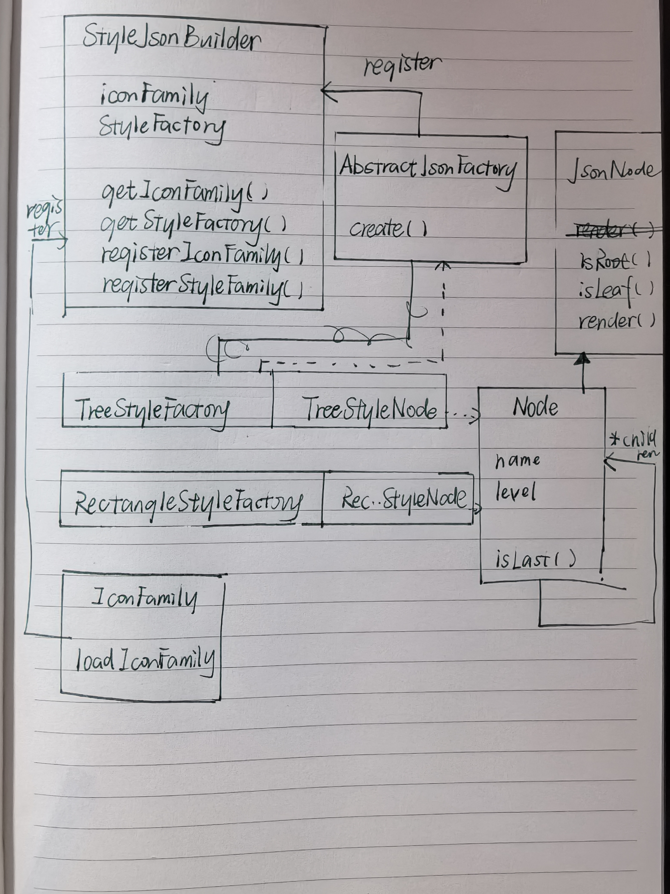
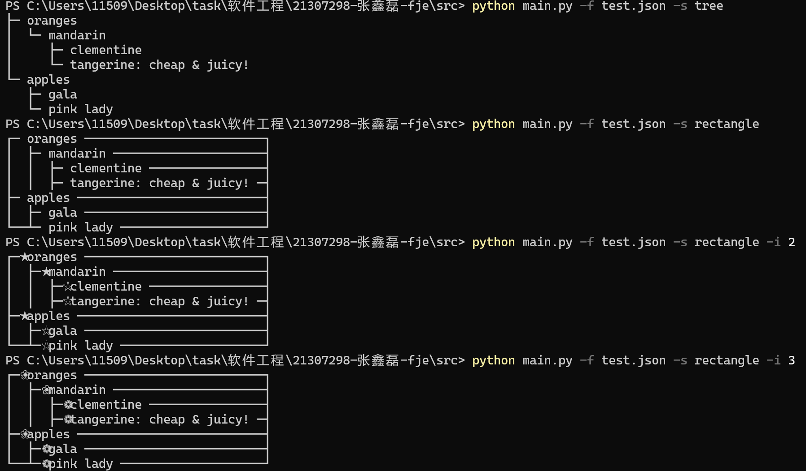

# 设计文档

类图



说明

使用的设计模式：建造者模式

```python
class Builder:

    def __init__(self):
        self._icon_families = {
            '1': IconFamily(' ', ' '),
            '2': IconFamily('★', '☆'),
            '3': IconFamily('❀', '❁')
        }
        self._styles_factory = {
            'tree': TreeStyledJSONNodeFactory(),
            'rectangle': RectangleStyledJSONNodeFactory()
        }

    def create(self, filepath: str, icon_family: str, style: str):
        icon_family = self._icon_families[icon_family]
        style_factory = self._styles_factory[style]
        json_node = JSONNodeFactory(filepath).create()
        return style_factory.create(json_node, icon_family)
```

抽象工厂模式

```python
class StyledJsonNode:

    def __init__(self, root: JsonNode, icon_family: IconFamily):
        self._root = root
        self._icon_family = icon_family

    @abstractmethod
    def render(self):
        pass

class StyledJsonNodeFactory(ABC):

    @abstractmethod
    def create(self, JsonNode, IconFamily):
        pass
```

工厂模式

```python
class TreeStyledJSONNodeFactory(StyledJSONNodeFactory):

    def create(self, JsonNode, IconFamily):
        return TreeStyledJSONNode(root, icon_family)
```

组合模式

```python
class JsonNode(ABC):
    def __init__(self, name: str, level: int):
        global id 
        self._name = name
        self._level = level
        self._id = id
        id += 1

    @abstractmethod
    def is_leaf(self) -> bool:
        pass

    @abstractmethod
    def get_childrens(self, function: Callable[['JsonNode'], None]):
        pass
    
class JSONComposite(JsonNode):
    # 其它函数省略

    def is_leaf(self) -> bool:
        return False

    def get_childrens(self, function: Callable[['JsonNode'], None]):
        function(self)
        for child in self._children:
            child.get_childrens(function)

    
    
class JSONLeaf(JsonNode):
    # 其它函数省略

    def is_leaf(self) -> bool:
        return True

    def get_childrens(self, function: Callable[['JsonNode'], None]):
        function(self)
```

# 两种风格、两种图标族运行示例



## 不改变现有代码增加新工厂

在builder中注册新工厂

```
styles_factory = {
    'tree': TreeStyledJSONNodeFactory(),
    'rectangle': RectangleStyledJSONNodeFactory(),
    'new_one': NewFactory()
}
```

在factory类中添加相应代码

```python
class NewFactory(StyledJSONNodeFactory):

    def create(self, JsonNode, IconFamily):
        return NewStyledJsonNode(root, icon_family)
```

仅仅只用修改builder和factory两处文件即可，避免了更改大量已实现的jsonnode的功能。

## 增加新的图标族

修改位于builder中的icon_family即可

```
icon_families = {
    '1': IconFamily(' ', ' '),
    '2': IconFamily('★', '☆'),
    '3': IconFamily('❀', '❁')
}
```

# github链接

